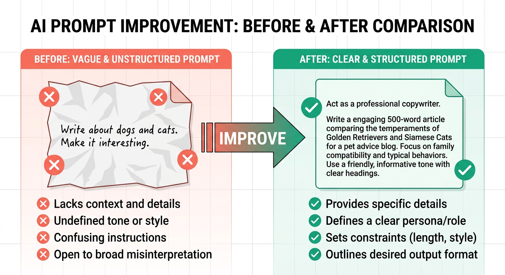
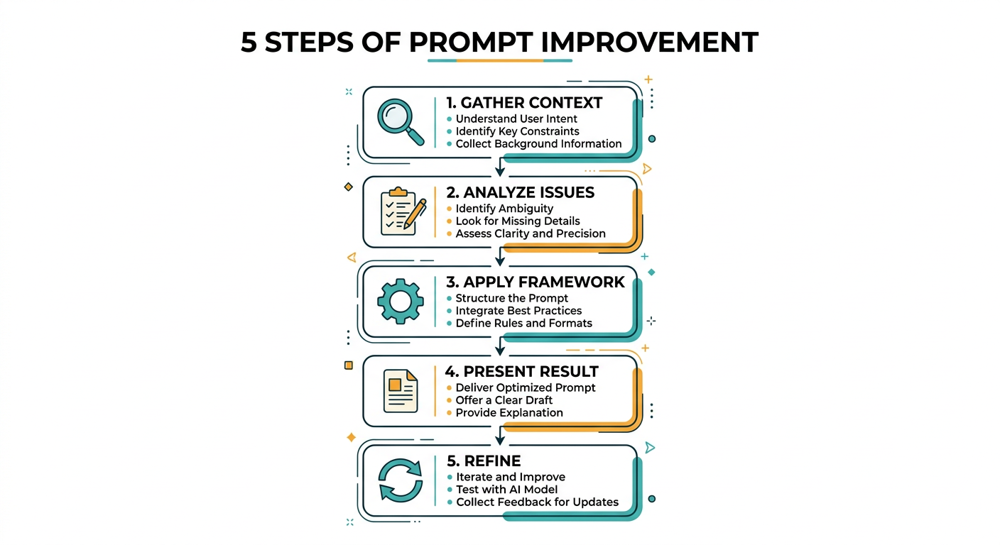
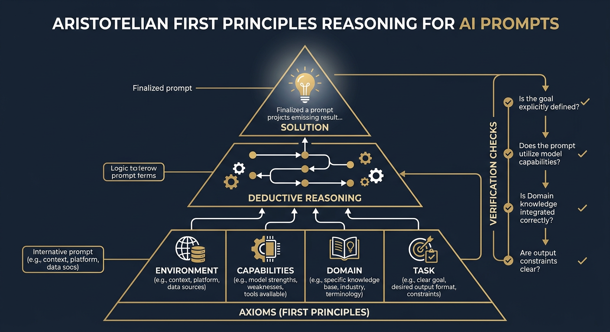

<p align="center">
  
</p>

<h1 align="center">Prompt Improver</h1>

<p align="center">
  A Claude Code skill that transforms vague AI prompts into clear, specific, actionable ones.
  <br/>
  Includes an optional <strong>Aristotelian First Principles</strong> mode for proof-based prompt design.
</p>

<p align="center">
  <a href="#installation">Install</a> &middot;
  <a href="#how-it-works">How It Works</a> &middot;
  <a href="#modes">Modes</a> &middot;
  <a href="#aristotelian-mode">Aristotelian Mode</a> &middot;
  <a href="#examples">Examples</a>
</p>

---

## What Is This?

Bad prompts produce bad results. This skill takes your rough prompt and rewrites it using a structured framework so the AI actually does what you want.

It works as a [Claude Code](https://docs.anthropic.com/en/docs/claude-code) skill -- install it once and invoke it whenever you need a better prompt.

<p align="center">
  
</p>

## Installation

Copy the skill into your Claude Code skills directory:

```bash
# Clone the repo
git clone https://github.com/ndpvt-web/prompt-improver.git

# Copy to your skills directory
cp -r prompt-improver ~/.claude/skills/prompt-improver
```

Or manually create `~/.claude/skills/prompt-improver/` and place the files there.

## How It Works

<p align="center">
  
</p>

The skill follows a 5-step workflow:

| Step | What Happens |
|------|-------------|
| **1. Gather Context** | Asks you about the target platform, priority, and missing details |
| **2. Analyze** | Identifies what is unclear, missing, or ambiguous in your prompt |
| **3. Apply Framework** | Runs your prompt through the 6-principle improvement framework |
| **4. Present** | Shows you the improved prompt with explanations of what changed |
| **5. Refine** | Asks if you want to adjust anything before using it |

### The 6-Principle Framework

Every prompt is evaluated and improved across these dimensions:

1. **Clarity and Specificity** -- Replace vague language with concrete terms
2. **Task Decomposition** -- Break complex requests into discrete steps
3. **Context Optimization** -- Include relevant context, remove noise
4. **Output Specification** -- Define format, length, and quality criteria
5. **Constraint Definition** -- State what to avoid and set boundaries
6. **Iteration Hooks** -- Build in checkpoints for refinement

See [`references/framework.md`](references/framework.md) for full details.

## Modes

### Standard Mode

Invoke the skill and it walks you through clarification questions, then produces an improved prompt.

### Quick Mode

Say "quick improve" and it skips questions, makes reasonable assumptions, and gives you a result fast.

### Aristotelian Mode (First Principles)

Say "Aristotelian", "first principles", or "proof-based" and it produces a prompt that instructs the receiving LLM to reason from first principles.

---

## Aristotelian Mode

<p align="center">
  
</p>

This is the advanced mode. Instead of just making a prompt clearer, it produces a prompt that **tells the AI to think differently** -- to reason from ground truths upward, like building a mathematical proof.

### How It Differs From Standard Mode

| Standard Mode | Aristotelian Mode |
|--------------|-------------------|
| Makes the prompt clearer | Makes the AI **reason** differently |
| Fixes surface issues (vagueness, scope) | Restructures **how the AI approaches** the task |
| Output: a better-worded prompt | Output: a prompt with reasoning directives, axioms, and verification |

### What the Improved Prompt Contains

When you use Aristotelian mode, the improved prompt has these sections:

```
REASONING DIRECTIVE
  Tell the LLM to identify atomic truths before acting

GIVEN AXIOMS
  Known facts baked in (system access, tools, domain constraints)

TASK
  What to accomplish

METHOD
  Instructions for the LLM to:
  1. Discover task-specific axioms
  2. Interrogate them (can they be decomposed? do they contradict?)
  3. Build the solution deductively from those axioms
  4. Trace every action to a specific axiom

VERIFICATION
  Tell the LLM to check its result against its axioms
```

### Why This Works

The Aristotelian approach is grounded in how LLMs actually process information:

- **Explicit axioms prevent hallucination** -- The model cannot invent false premises when true ones are stated
- **Deductive structure improves chain-of-thought** -- Each step follows logically from the last
- **Self-interrogation catches errors early** -- The model checks its own assumptions before building on them
- **Traceability makes debugging possible** -- If something fails, you can trace it back to the axiom that broke

### When to Use It

- Complex multi-step tasks where getting the foundation wrong cascades into failure
- Tasks where precision matters (infrastructure, security, data integrity)
- When you want the AI to show its reasoning and justify every decision
- When the AI keeps making wrong assumptions about your environment

### When NOT to Use It

- Simple prompts that just need clearer wording (use standard mode)
- Creative/open-ended tasks where rigid structure over-constrains
- When speed matters more than rigor (use quick mode)

See [`references/aristotelian.md`](references/aristotelian.md) for the complete methodology.

## Examples

### Standard: Vague to Specific

**Before:**
> help me write some code

**After:**
> Write a Python function that validates email addresses. Requirements:
> - Accept a string input, return boolean
> - Check for valid format (user@domain.tld)
> - Handle edge cases (empty string, missing @, etc.)
> - Include docstring with examples
> - No external dependencies

### Aristotelian: Deploy My App

**Before:**
> deploy my app to production

**After:**
> **Reasoning Directive:**
> Before taking any action, reason from first principles. Identify the fundamental,
> irreducible truths relevant to this deployment.
>
> **Given Axioms:**
> - You have root access on a Linux environment with Bash
> - You are Claude Opus 4.6 with Read, Write, Edit, and Bash tools
> - This is a Next.js project (verify via package.json before assuming version)
> - The goal is a running production server returning HTTP 200
>
> **Method:**
> 1. Identify atomic truths: what must exist for build to succeed? For server to start?
> 2. Interrogate: do any axioms contradict? Are any redundant?
> 3. Execute each step, stating which axiom justifies it
> 4. If any step fails, trace back to identify which axiom was violated
>
> **Verification:**
> Check your result against every axiom. Does it satisfy them all?

See [`references/examples.md`](references/examples.md) for more before/after transformations.

## File Structure

```
prompt-improver/
  SKILL.md                         # Main skill definition
  references/
    framework.md                   # The 6-principle improvement framework
    aristotelian.md                # Aristotelian first principles methodology
    examples.md                    # Before/after transformation examples
    anti-patterns.md               # Common prompt issues and fixes
  images/
    capybara-mascot.png            # Project mascot
    workflow-diagram.png           # Standard workflow flowchart
    aristotelian-diagram.png       # First principles reasoning diagram
    before-after.png               # Before/after comparison visual
```

## Anti-Patterns

The skill also catches and fixes common prompt problems:

| Problem | Fix |
|---------|-----|
| "Make it better" | Define specific quality criteria |
| "Do everything" | Prioritize and scope explicitly |
| "You know what I mean" | State assumptions explicitly |
| "Be creative" | Provide constraints that enable creativity |
| Multiple unrelated asks | Split into separate focused prompts |
| Wall of text | Structure with headers and bullets |
| No success criteria | Define what "done" looks like |

See [`references/anti-patterns.md`](references/anti-patterns.md) for the full list.

## License

MIT

---

## Keywords

> *For the search engines and the curious humans who find things by typing random words*

prompt engineering, AI prompt optimizer, better AI prompts, prompt improvement tool, Claude prompt enhancer, Aristotelian reasoning, first principles prompting, prompt refinement, AI prompt design, prompt optimization skill, Claude Code skill, better ChatGPT prompts, LLM prompt engineering, prompt crafting tool, AI writing prompts

